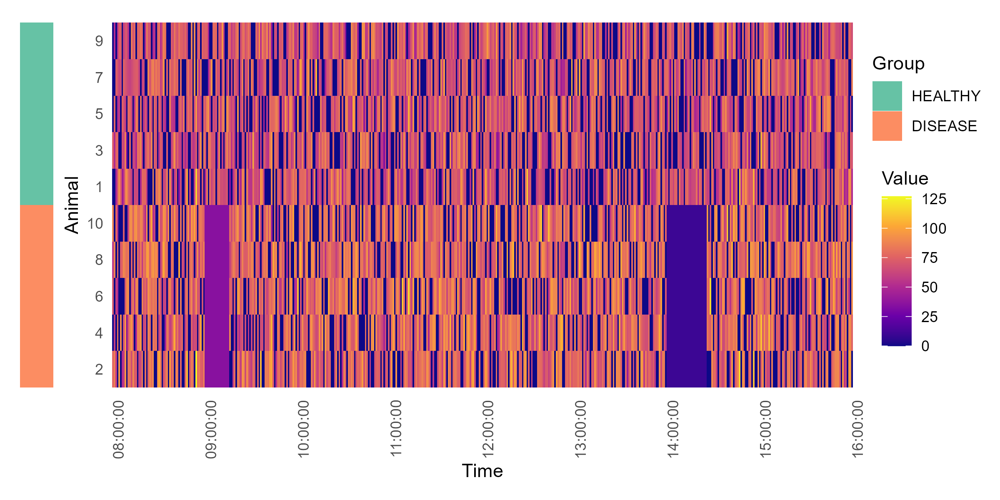
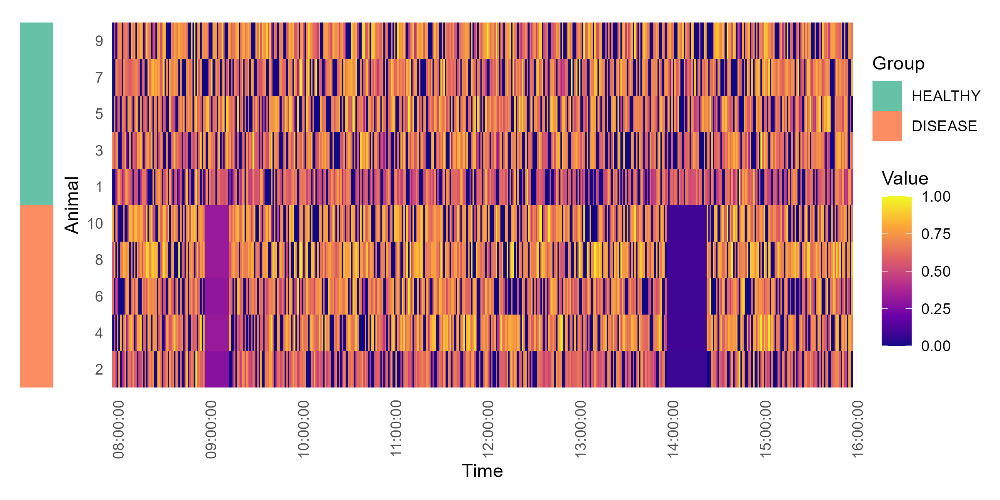
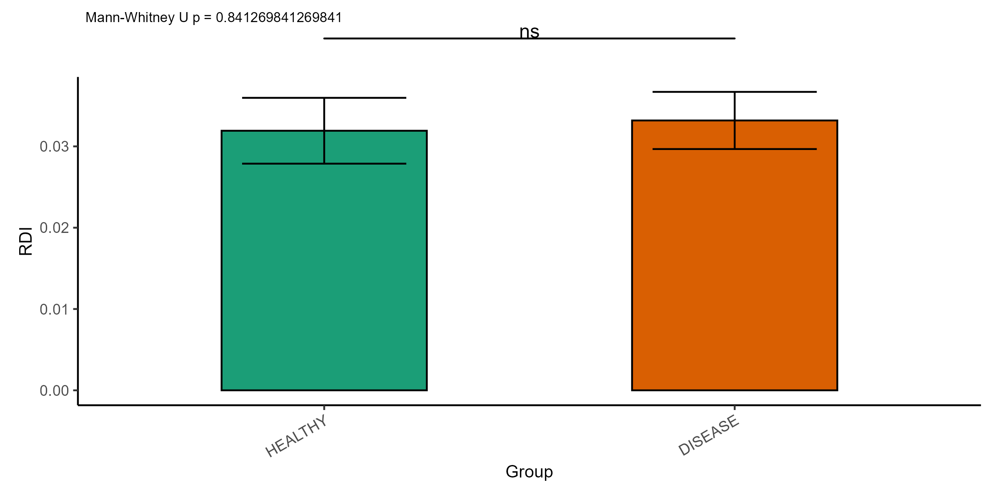
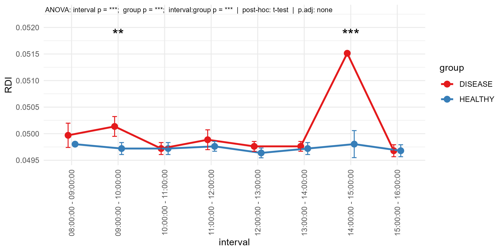

### MoveCalcR – R Tool for rodent movement analysis


<br />


<p align="right">


</p>


### Author: Jakub Kubiś


<br />

## Description

This package provides a comprehensive toolkit for analyzing locomotor activity data, primarily designed for datasets generated by the PhenoMaster system (TSE Systems), but flexible enough to support movement data from other behavioral monitoring platforms. It is suitable for time-series activity data collected in animal studies and includes tools for preprocessing, quantification of behavioral regularity, group comparisons, and rich data visualizations. The package is intended for researchers working in neuroscience, behavioral genetics, and pharmacology who are analyzing longitudinal activity data from rodents or other model organisms.

Included functionalities:
- Loading and preprocessing of activity time-series data
- Filtering of raw signals with optional low-pass filters
- Calculation of Sample Entropy for complexity analysis
- Computation of the Regularity Disruption Index (RDI)
- Group-level statistical comparisons with appropriate tests
- Generation of boxplots, violin plots, and barplots with p-value annotations
- Export of plots and summary statistics for reporting
- Modular functions for flexible integration into larger analysis workflows

The package supports both exploratory and inferential workflows and allows reproducible and automated processing of large-scale movement datasets.

<br />


#### Loading

```
source('https://raw.githubusercontent.com/jkubis96/MoveCalcR/refs/heads/main/scripts/moveCalcR.R')
```

<br />

#### Documentation

* [MoveCalcR](https://jkubis96.github.io/MoveCalcR/)

<br />


#### Example usage in R

```

source('https://raw.githubusercontent.com/jkubis96/MoveCalcR/refs/heads/main/scripts/moveCalcR.R')

# loading scripts for statistics and visualization --> https://github.com/jkubis96/JStatML-R
source("https://raw.githubusercontent.com/jkubis96/JStatML-R/main/scripts/statML-R.R")


example_data <- read_mvd(path = 'https://raw.githubusercontent.com/jkubis96/MoveCalcR/refs/heads/main/data/example_data.csv')


example_metadata <- read_mvd_meta(path = 'https://raw.githubusercontent.com/jkubis96/MoveCalcR/refs/heads/main/data/example_data.csv')


data <- group_mdv(data = example_data, metadata = example_metadata, animal_col = "Animal No.", group_col_meta = "Text1")

data <- set_hour(data, time_col = 'Time', down = '16:00:00', up = '08:00:00') 


# variables to calculate 
print(colnames(data))
  
plot_movment <- mvd_map(data, animal_col = "Animal No.", 
                       time_col = "Time", 
                       stat_col = "XT+YT[Cnts]", 
                       group_col = 'group', 
                       group_sort = c('HEALTHY', 'DISEASE'))


plot_movment
```
<br />


***Movement plot - heatmap***

<br />


<p align="center">

</p>


<br />


```
rescaled_data <- rescale_by_group(data, value_col =  "XT+YT[Cnts]", group_col  = "Animal No.")


plot_movment_rescaled <- mvd_map(rescaled_data, animal_col = "Animal No.", 
                                time_col = "Time", 
                                stat_col = "XT+YT[Cnts]", 
                                group_col = 'group', 
                                group_sort = c('HEALTHY', 'DISEASE'))


plot_movment_rescaled
```
<br />


***Movement plot rescaled (0-1) value - heatmap***

<br />


<p align="center">

</p>


<br />


```
full_time_rdi = mvd_rdi(data, 
              animal_col = 'Animal No.',
              group_col = 'group',
              groups = c('HEALTHY', 'DISEASE'),
              stat_col = "XT+YT[Cnts]",
              lambda = 0.005, 
              m = 2, 
              r = 0.2,
              flow = 1/2000, 
              fhigh = 1/300, 
              fs = 1) 


  
results <- two_groups_analysis(value_column = 'RDI', 
                               grouping_column = 'Group', 
                               data = full_time_rdi, 
                               bar_queue = c('HEALTHY', 'DISEASE'), 
                               x_label = 'Group', 
                               x_angle = 30, 
                               y_label = 'RDI', 
                               size = 10, 
                               bar_size = 0.5, 
                               parametric = FALSE, 
                               paired = FALSE, 
                               bars = 'sd', 
                               bars_size = 1, 
                               stat_plot_ratio = 0.15, 
                               y_break = NaN, 
                               brew_colors = 'Dark2') 

  
results@bar_plot
```
<br />


***Bar plot - RDI total time***

<br />


<p align="center">

</p>


<br />


```
interval_rdi <- mvd_rdi_interval(data,
                           interval = 60,
                           time_col = 'Time',
                           animal_col = 'Animal No.',
                           group_col = 'group',
                           groups =  c('HEALTHY', 'DISEASE'),
                           stat_col =  "XT+YT[Cnts]",
                           lambda = 0.005, 
                           m = 2, 
                           r = 0.2,
                           flow = 1/2000, 
                           fhigh = 1/300, 
                           fs = 1) 


interval_rdi_plot <- multi_var_groups_analysis(interval_rdi,
                                   stat_col = "RDI", 
                                   interval_col = 'interval', 
                                   group_col = 'Group',
                                   parametric = TRUE,
                                   paired = FALSE,
                                   adj = NA,
                                   error = 'sd',
                                   tx_pos = 0.01)


interval_rdi_plot@plot
```

<br />


***Line plot - RDI over time intervals***

<br />


<p align="center">

</p>


<br />

<br />


#### Have fun JBS©